## 人工智能概览

## AI 数学基础

## Python基础

## 搜索概览

1. 为什么我们平等对待每一个动作？ -> 启发搜索
2. 当有一个对手和我们博弈的时候？ -> minimax和剪枝
3. 如何系统性的用符号表达状态？ -> 逻辑
4. 如果环境的转变是不确定性的？ -> 不确定性和概率推理
5. 搜索空间太大了？ -> 蒙特卡洛搜索

## 搜索：UCS 和A*

1. UCS：优先扩张代价最小的节点，总成本的优先队列

   1. 离开优先队列才变成已扩展的节点
   2. 考虑过的，但还没到达过的，如果有更小的代价， 更新

2. A*

   1. 根据UCS和贪心的和决定扩展顺序：$f(n)=g(n)+h(n)$

   2. 可接受启发（**树搜索**最优）：$0\le h(n)\le h^*(n)$

      证明如果启发函数是可接受的，那么A*最优，即证A比B更早离开优先队列（只要出队列就是最优解）：

      只要证明 $f(n)\le f(A)<f(B)$ 那么最优目标节点的每个前序节点都比次优目标节点先弹出，轮不到次优目标节点弹出
      $$
      f(n)=g(n)+h(n)\le  g(n)+h^*(n)=g(A)+h(A)=f(A)
      $$
   
      $$
      f(B)=g(B)+h(B)=g(B)<g(A)=g(A)+h(A)=f(A)
      $$
   
      
   
   3. 一致启发（**图搜索**最优）： $h(A)-h(C)\le cost(A\ to\ C)$ 
   
      一致性说明：在一条路径上f值不会减小
   
      可以看作是对每一个合拢的节点，启发函数都是可接受的，否则对这个节点可能不最优

## 搜索：逻辑和CSP

1. CSP问题

   1. 变量：WA，NT

   2. 域：{red, green, blue}

   3. 约束：相邻区域颜色不同

   4. 目标：所有满足约束的变量赋值方式

   5. 约束图：把互相之间有约束的变量连接起来

      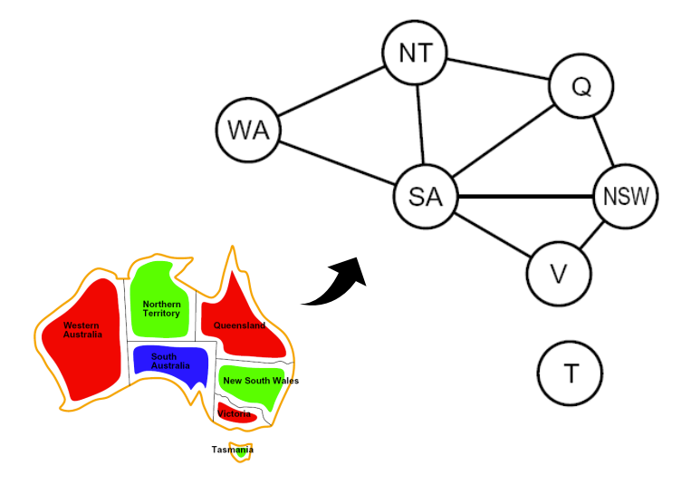

2. 回溯法

   1. 简单改进
      1. 一次（每层）只考虑一个变量，变量赋值的顺序不重要
      2. 每一步判断约束的满足情况，只考虑与前序赋值不矛盾的可能
      3. 解决25皇后问题
   2. 顺序改进
      1. 什么变量应该下一个赋值（MRV）？选择有最多约束，即最少可能的变量
      2. 每个变量应该先试什么值（LCV）？一个变量要被赋值的时候，选给剩下的变量留下最多可能的值
      3. 解决1000皇后问题
   3. 筛选改进：提早识别失败
      1. 提前检查（forward checking）: 去掉那些加到现有赋值中就会违反一些约束的值。对于图染色是除去一圈同颜色的
      2. 约束传递（constraint propagation）：可以确保所有的边都是一致的。一致（consistency）：对于每一个X的剩余值，Y都有某个赋值方式，使其不会违反约束。对于图染色是对于除去同颜色的一圈之后，对只有一种可能的节点再除去同颜色的一圈
   4. 发现所有可能的失败是NP-hard，但是CST可以转化为有更高效算法的SAT (Boolean Satisfiability Problem)问题

3. SAT问题

   是否存在一种布尔赋值组合， 使所有的逻辑约束都能被满足

4. SAT问题高效算法

   1. DPLL
      1. 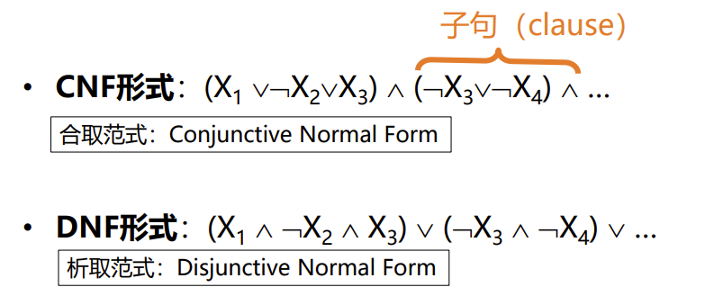
      2. 在深搜过程中依次设置每个变量的值，当子句为假的时候，回溯
      3. 单字符传递（unit propagation）：当某个子句只剩下一个字符（literal），对这个变量赋值使子句为真
      4. 布尔约束传递(Boolean Constraint Propagation，BCP):  重复使用单字符传递，直到无法使用为止
   2. CDCL（矛盾引导的子句学习）

## 对抗搜索

1. Minimax

   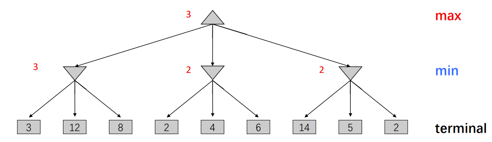

2. Alphabeta

   $\alpha$ ：最终MAX节点能取到的最大数，随着搜索**递增**

   $\beta$ ：最终MIN节点能取到的最小数，随着搜索**递减**

   在搜索过程中得到的数要在 $\alpha$ 和$\beta$ 之间，否则剪枝，并且两者之差随着深度增加而减小

   剪枝不影响根的极大极小值，但是**根的子节点可能有错误的值**，在实际应用中可能不能通过该剪枝进行下一步决策

3. 多智能体效用

4. 期望最大化搜索

   1. Max节点与极大极小搜索相同
   2. 概率节点类似于Min节点，但结果不确定
      1. 计算它们的预期效用
      2. 即，对它们的子节点进行加权平均（预期值）

## 蒙特卡洛搜索

1. 平衡抽样的不确定性，既想抓住最优的玩下去，又怕自己判断错： $\epsilon-greedy$ 

   有了现在的估值：

   以1 − 𝜀的概率 选当前最优的

   以𝜀的概率 随机选取一个当前不是最优的

   缺点：对所有非最优动作一视同仁

   因此：更多地尝试更有希望成为更优的动作，算法的效率将更高

2. 最大置信（Upper Confidence Bound）

   尝试越多估值越准确，那么尝试次数少的估计不准确，需要探索

   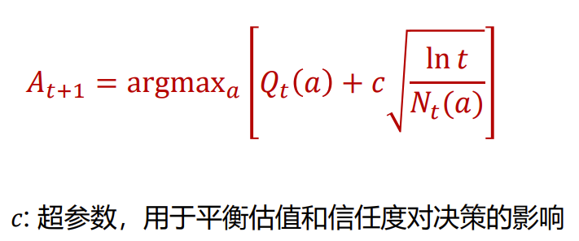

   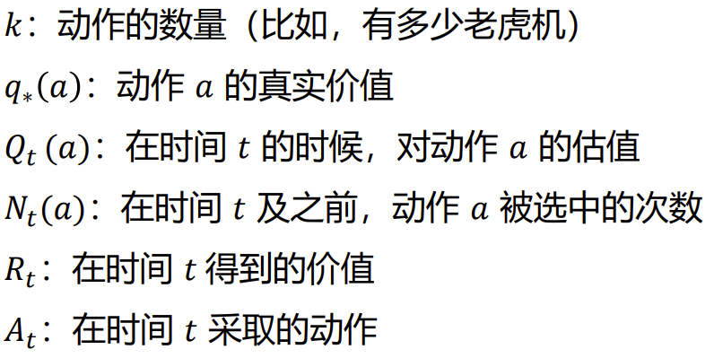

3. MCTS：选择 扩展 模拟 回溯

## 机器学习基础和线性回归

1. 机器学习模型分类

   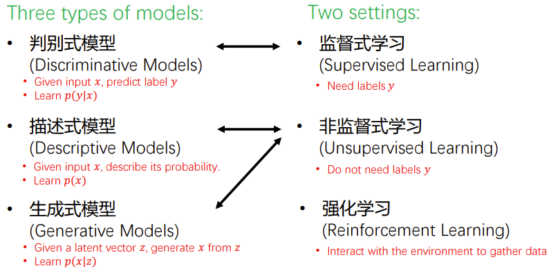

2. 分类 vs 回归

3. 模型训练过程(Training)

   1. 特征提取
   2. 模型训练

4. 模型评估 (Testing/Evaluation)

   1. 训练误差：最小化训练误差来训练模型
   2. 测试误差：越低越好。用来衡量泛化能力
   3. 过拟合：错把训练样本中的特殊规律当做普遍规律
   4. 欠拟合：连训练样本都没有拟合好
   5. 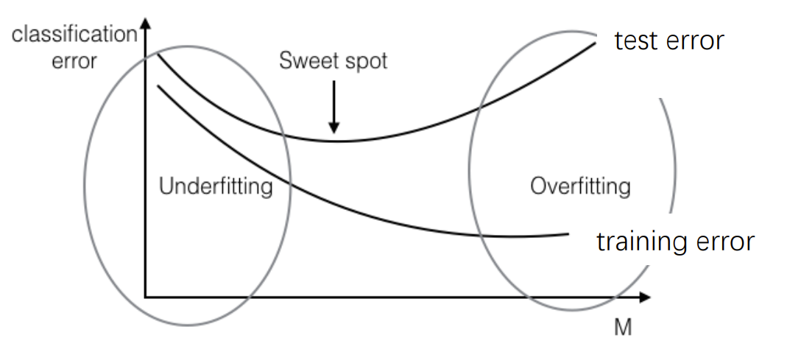

5. k近邻 (k-Nearest Neighbor, k-NN) 算法

   1. 用训练样本中距离它最近的k个样本中占多数的标签来预测测试样本
   2. 优点：
      1. 不需要训练
      2. 只需要一个距离函数，默认为欧氏距离
   3. 缺点
      1. 需要存储所有训练样本
      2. 在测试时需要计算测试样本到所有训练样本的距离
      3. 有时很难找到一个好的距离函数

6. 维度灾难

   1. k=10

      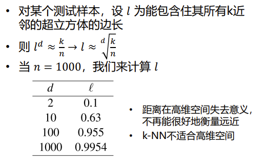

   2. 这说明：在找最近的k个样本时，这k个样本越来越趋近于边缘，第k个和第n个样本与测试样本的距离区别很小，从而距离的概念用处不大了

7. 非参数化模型 vs 参数化模型

   1. 非参数化模型
      1. 例如：k-NN：模型不能被有限参数 (parameters) 定义，或不包含参数
      2. 需要保留训练样本，以对测试样本做出预测
   2. 参数化模型
      1. 如：线性回归、神经网络等
      2. 模型包含可训练的参数，通过拟合训练数据来估算模型参数
      3. 训练好模型参数后，可以丢弃训练数据，仅依靠模型参数去预测新样本
      4. 可以写成 𝑦 ≈ 𝑓(𝑥) , 𝑓为包含参数的模型

8. 最简单的参数化模型——线性模型

9. 线性回归

10. 线性回归训练

    1. 平方损失函数

       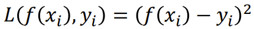

    2. 在训练集上最小化平均损失函数来优化参数𝑤, 𝑏

       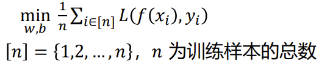

    3. 将要优化的目标 (objective) 写作变量 𝑤, 𝑏 的函数，使 𝑤, 𝑏 向负梯度方向走一小步: 梯度下降 (Gradient Decent)

       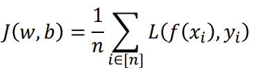

       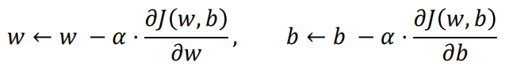

       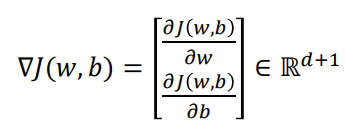

    4. 线性回归的梯度下降

       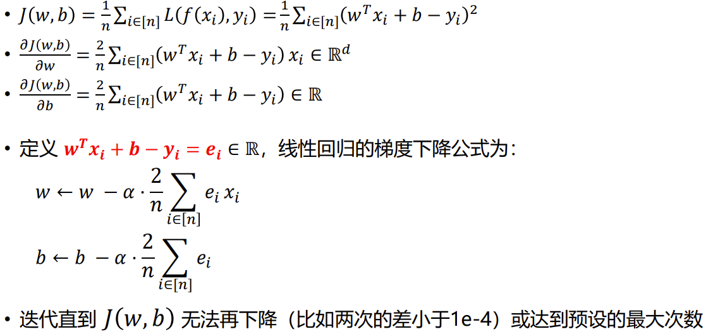

11. 凸函数

    1. 当 𝑓 是个凸函数（convex function）时，local minimum一定是global minimum
    2. 最小化凸函数称为凸优化，对于凸优化我们可以方便地找到全局最小点，例如使用梯度下降

12. 学习率

    1. 学习率过大：无法收敛
    2. 学习率过小：收敛缓慢
    3. 选择适中的学习率，或逐步减小学习率

13. 线性回归优化

    损失函数是关于 $(𝑤^𝑇 , 𝑏)^\text{𝑇}$ 的凸函数 （Hessian半正定） 

    因此可以采用梯度下降找到全局最小值

## 逻辑回归、多分类与正则化

1. 二分类

   1. 标签只有正类和负类

   2. 使用线性函数 $+$ 非线性sigmoid函数拟合正类的概率： $p(y=1|x)=\sigma(w^Tx+b)$

   3. 最大似然：最大化拟合成功的概率 

   4. 将最大似然函数作为二分类的Loss函数

   5. 再将最大对数似然写成最小化平均损失，即经验风险最小化（ERM）：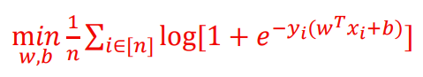

      其中log项为交叉熵损失，也称为Logistic Loss

   6. 从替代损失函数视角看待逻辑回归：最小化上界同样可以最小化零一损失函数，即分类错误数因此称为替代损失函数

   7. 逻辑回归的训练

      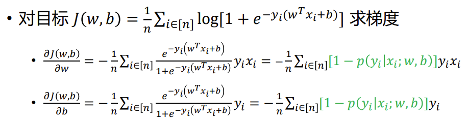

      把样本 𝑖 预测为其真实标签的概率越接近1（充分拟合样本），那么这个样本对梯度的贡献越小

2. 多分类问题（Softmax 回归）

   1. 标签有K类
   2. 使用softmax函数拟合第k类的概率：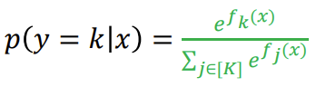
   3. 最大对数似然：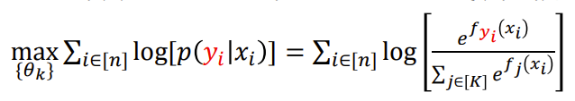
   4. 等价于最小化交叉熵损失（Loss）：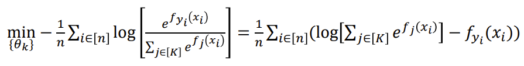

3. 正则化

   1. 在损失函数后加一项一起优化：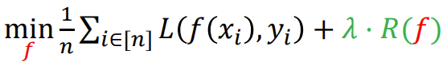

      惩罚过于复杂的模型，防止过拟合

      𝜆较小过拟合，较大欠拟合

   2. 过拟合原因1：某几个特征维度 𝑗 支配 (dominate) 了预测，即这些维度的权重 𝑤𝑗 过大

      解决方法：L2 正则化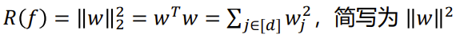

      作用： 放大较大的权重，用于惩罚少数过大的权重维度，使权重分配更平均

   3. 过拟合原因2：输入数据中存在大量没用的特征维度，但仍然赋予了它们非零的权重

      解决方法：L1 正则化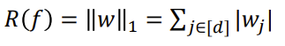

      作用：鼓励稀疏的 𝑤，即 𝑤 中大部分维度为零，仅有少数维度非零

   4. 带正则化的回归

      1. 岭回归 (Ridge Regression)：线性回归 + L2 正则化

         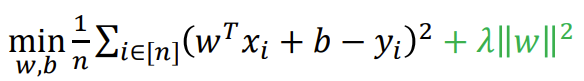

         梯度：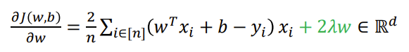

         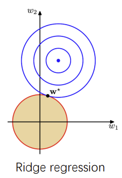

      2. Lasso 回归：线性回归 + L1 正则化

         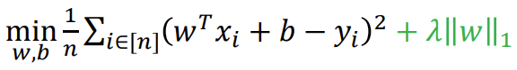

         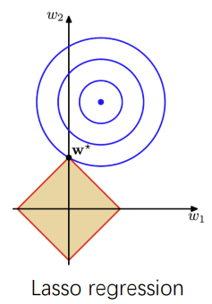

      3. 逻辑回归 (完整形式)：交叉熵损失 + L2 正则化

         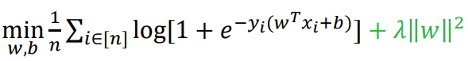

         梯度：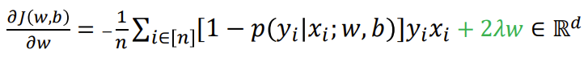

      4. 支持向量机 (Support Vector Machine, SVM) （最大间隔准则）：合页损失 (Hinge Loss) + L2 正则化

         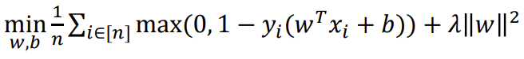

4. 超参数与模型选择

   1. 使用验证集 (validation set) 来选择最优超参数

   2. 训练集 : 验证集 : 测试集=8 : 1 : 1

   3. 验证集：验证超参数的好坏

      在训练集上训练参数，在验证集上验证模型误差，选择在验证集上误差最小的模型和超参数

   4. 在测试集上最终测试模型误差，估计模型泛化能力

## 决策树与随机森林

1. 决策树

   1. 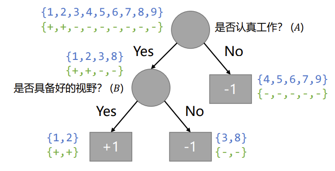
   2. 希望决策树的分支节点所包含的样本子集 “纯度”不断增高，即每个子集都尽量只包含同类的标签，这样𝑀是一个较好的划分属性

2. 度量集合纯度——信息熵H(X)

   1. $H(X)=\sum_{x}{f(x)\log_2\frac{1}{f(x)}}=-\sum_{x}{f(x)\log_2f(x)}$

   2. 直观理解：信息熵是信息量的期望

      所有事件概率越一样，不确定性越大，信息量越大，信息熵越大

      随机变量越趋向于一个事件，越确定，纯度越高，信息熵越小

      所以**决策之后每一类信息熵越小越好**

   3. 图解几类熵的关系

      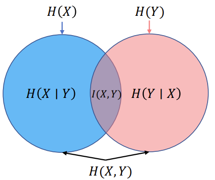

   4. 联合熵

      定义： $H(X,Y)=-\sum\limits_{x}\sum\limits_{y}f(x,y)\log_2f(x,y)$

      如果X与Y互相独立，那么有： $H(X,Y)=H(X)+H(Y)$

      如果X与Y同分布，那么有：$H(X,Y)=H(X)=H(Y)$

   5. 条件熵：与条件概率类似

      定义： $H(Y|X)=\sum\limits_{x}f(x)H(Y|X=x)$

      计算公式：
      $$
      \begin{aligned}
      H(Y|X)&=\sum\limits_{x}f(x)H(Y|X=x)\\
      &=-\sum\limits_{x}f(x)\sum\limits_yf(y|x)\log_2f(y|x)\\
      &=-\sum\limits_{x}\sum\limits_{y}f(x,y)\log_2f(y|x)
      \end{aligned}
      $$
      条件熵与联合熵的关系： $H(Y)+H(X|Y)=H(X,Y)$

      证明：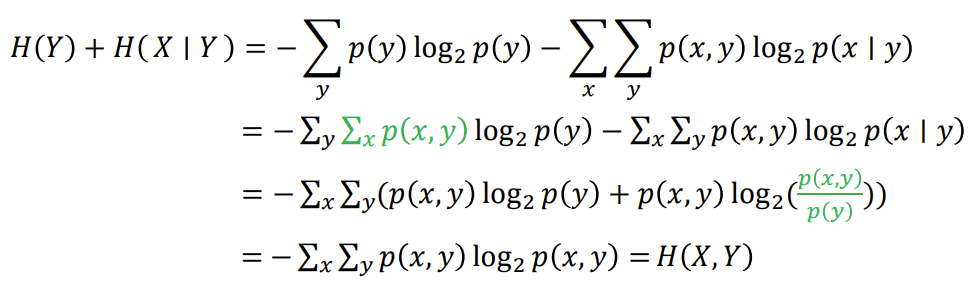

   6. 互信息：与协方差类似

      定义： $I(X,Y)=H(X)+H(Y)-H(X,Y)$

      计算公式： $I(X,Y)=H(X)-H(X|Y)=H(Y)-H(Y|X)$ 	

3. 选择划分准则

   1. 信息增益（gain）

      1. 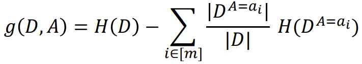

      2. $$
         \begin{aligned}
         g(D,A)&=I(D,A)\\
         &=H(D)+H(A)-H(D,A)\\
         &=H(D)-H(D|A)
         \end{aligned}
         $$
         
      3. 决策A对应的 $g(D,A)$ **越大越好**，偏好取值数目较多的属性
      
   2. 增益率（gain ratio）
   
      1. 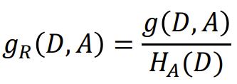
   
      2. $$
         g_R(D,A)=\frac{g(D,A)}{H(A)}
         $$
   
      3. 决策A对应的 $g_R(D,A)$ **越大越好**，偏好取值数目较少的属性
   
   3. 基尼指数（Gini Index）
   
      1. 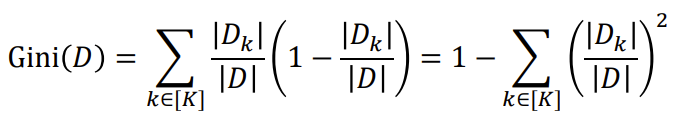
      2. 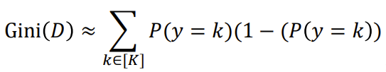
      3. 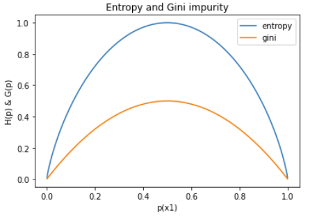
      4. 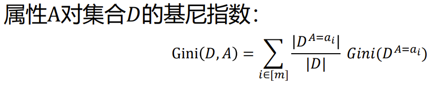
      5. **属性 $i$ 对集合D的基尼指数越小越好**
   
4. 连续属性：属性二值化

   1. 选取一个划分点，将属性𝐴二值化
   2. 对每个属性，选择最大化信息增益的划分点
   3. 对所有属性，选择最大化信息增益的属性

5. 连续标签：从决策树变为回归树

   1. 通过 L2 Loss定义集合的纯度

   2. L2 Loss就是标签A的每个等价类的方差（不除以n）之和

      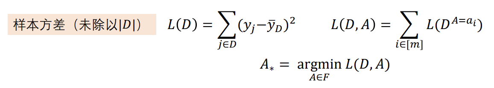

   3. 决策对应的**L2 Loss越小越好**

6. 集成学习(ensemble learning)

   1. 集成学习 = 多个个体学习器 + 结合策略
   2. 个体学习器例子：线性模型，决策树
   3. 集成学习例子：随机森林 = 决策树 + 样本扰动、属性扰动
      1. 样本扰动：对于每一个决策树，对训练集进行随机采样得到一个独立的训练集
      2. 属性扰动：对于每一个决策树，只选择一部分样本特征进行子树划分训练
      3. 最后，用所有训练好的决策树的平均预测（如多数类）作为对测试样本的输出

## 神经网络与反向传播

1. 正向传播的常见激活函数：

   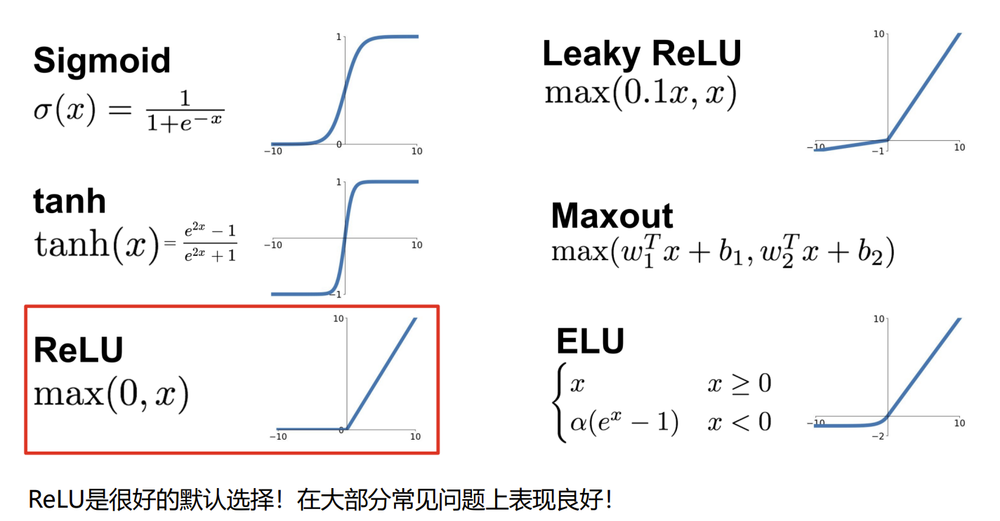

2. 正向传播的输出

   1. 对回归问题，直接输出
   2. 对二分类问题，用sigmoid函数输出正类概率
   3. 对 K 分类，输出层使用 K 个神经元，最后一层等价于一个softmax回归

3. 反向传播

   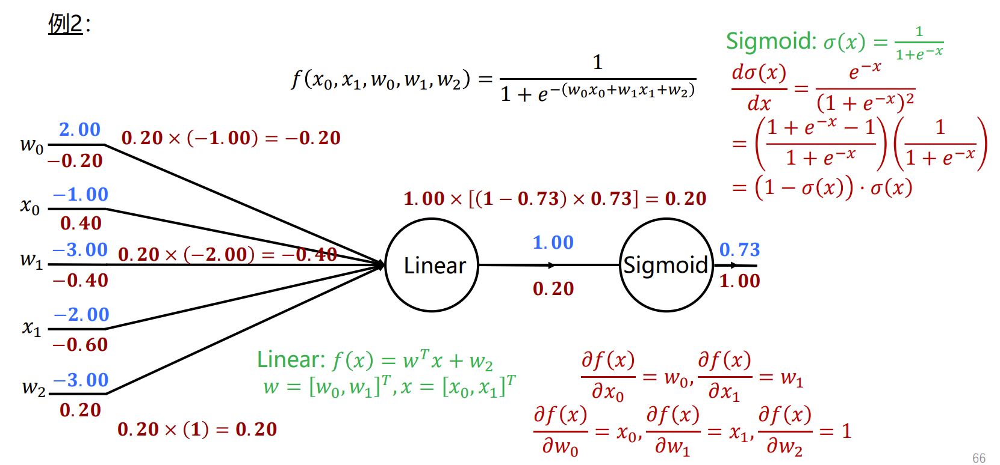

## 各类特殊神经网络

## 计算机视觉——概述

1. 计算机视觉的概念
   1. 视感觉：将光信号转化为人脑或计算机可处理的电信号或图像
   2. 视知觉：实现对显示场景的理解，如分辨物体种类，判断距离，理解文字、行为、情感等
2. 计算机视觉的历史与发展
3.  计算机视觉的研究方向
4. 计算机视觉的应用

## 计算机视觉——图像分类

1. 图像分类的定义

   判断图像所属的类别标签

2. 图像分类的难点

   1. 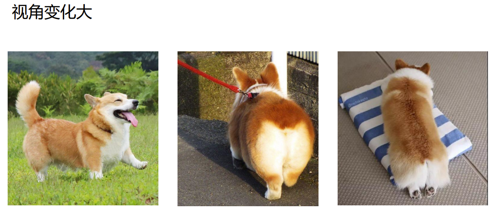
   2. 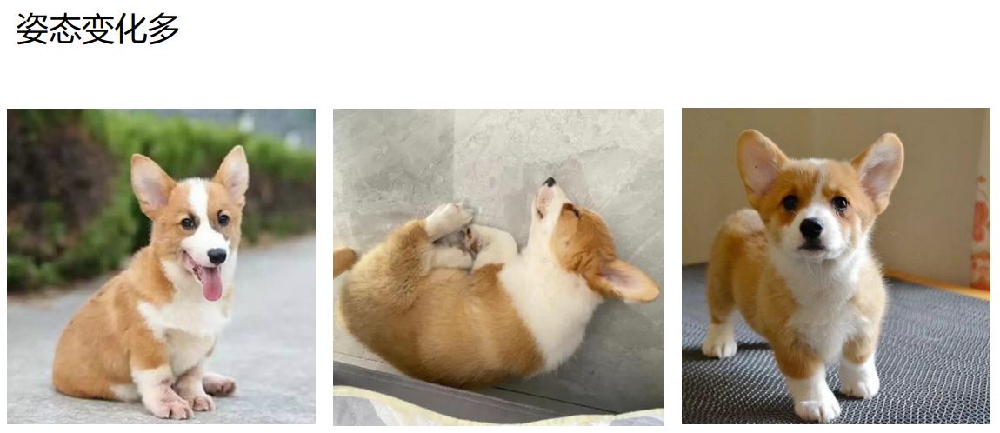
   3. 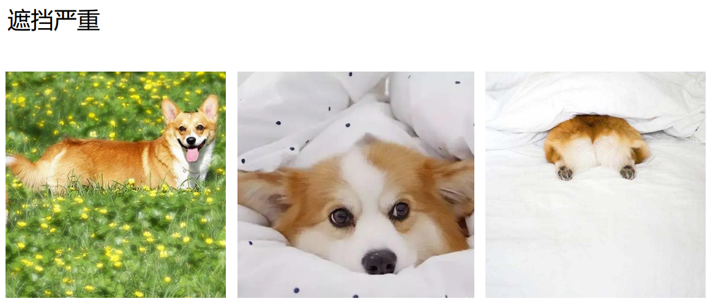
   4. 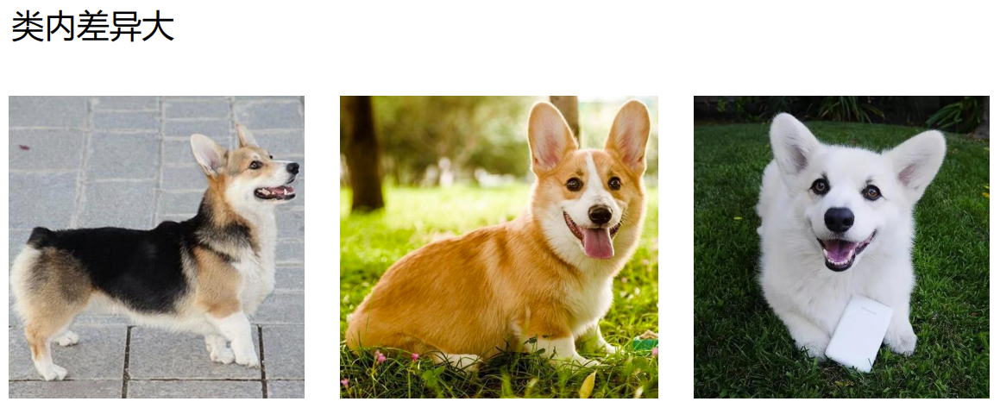
   5. 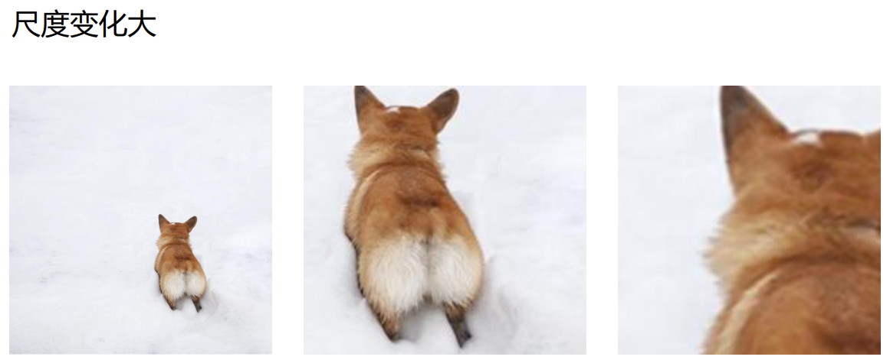

3. 图像分类的应用

4. 图像分类数据集

   1. MNIST数据集：手写数字，书写风格、 线条粗细、字符方向不同，各数字类内差异巨大

   2. CIFAR-10数据集：10类常见物品和动物

   3. ImageNet数据集：1400多万张带标签图像，2万多个类别，并为超过100万张图像提供了边框

      在ImageNet的推动下，ILSVRC挑战赛中图像分类的准确率从71.8％上升到97.3％，远远超过了人类的水平，这可能说明这个数据集过拟合了

5. 经典的图像分类算法

   1. 位深度：存储每个像素需要的bit数量

      图像的位数通常是8位，可以表示256种数量级，灰度范围对应0-255

   2. 如何实现图像分类

      提取特征，通过分类器输出类别预测结果

   3. 特征空间：特征向量所在的空间，每一个特征对应特征空间中的一个点

   4. 分类器：对数据/特征进行分类的模型，最终输出分类结果

   5. 局部特征-BoWs(Bag-of-Words)

      特征提取+特征聚类+分类器：先提取图像的局部特征，通过聚类筛选类内共有特征，利用共有特征训练特征分类器

6. 特征提取算子——梯度直方图(Histograms of Oriented Gradients, HOG)

   1. 可以忽略人体细微肢体动作而不影响检测效果，因此，HOG特征适合用于图像中的行人检测

   2. 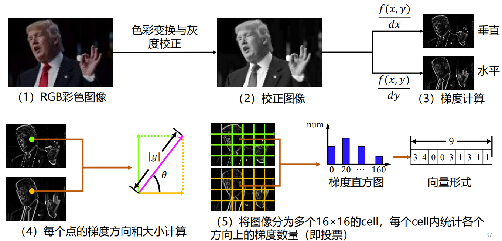

      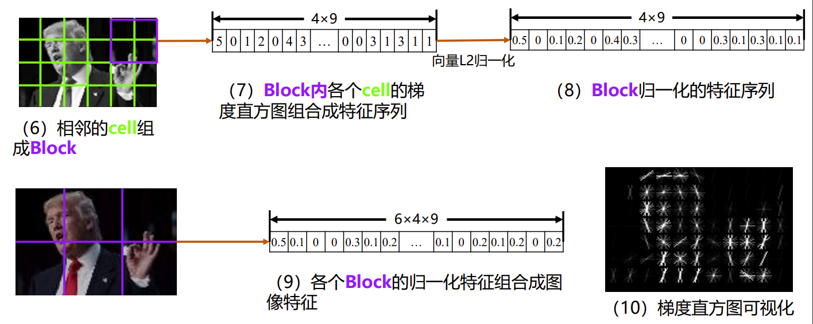

7. 特征提取算子——Haar

8. 特征提取算子——SIFT

9. 三种特征提取方法的比较

   1. HOG
      1. 忽略肢体动作，适合行人检测
      2. 计算量大，无法处理遮挡
   2. Haar
      1. 使用模板匹配，计算速度快，适用于人脸检测
      2. 对旋转适应性不佳
   3. SIFT
      1. 信息量丰富，检测匹配速度快，可以部分解决遮挡、角度变化的问题
      2. 对边缘光滑的目标无法准确提取特征

10. 分类器-最近邻法

    给定测试图像，在查找库中搜索K个最相似的图像，对测试图像类别进行投票

    类似非参数化模型（k近邻算法-9.5）

11. 分类器-线性分类法

    1. 二分类：一条直线将特征空间划分成两个类别

    2. 多分类：one-to-one，一条直线区别两类，非这两类的随机分配

       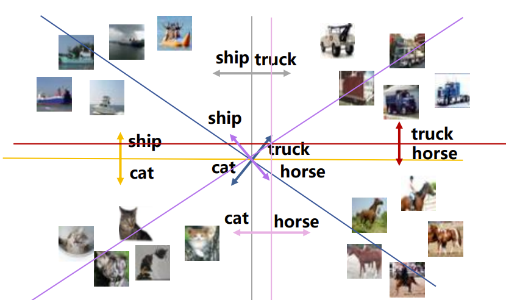

    3. 多分类：one-to-all，一条直线区别一类与其余类

       

## 计算机视觉——三维重建

### 针孔模型

通过三角形相似关系可以得到空间中的点与图像中点的对应关系

### 摄像机几何

$(c_x,c_y)^T$ 是在目标系下，原始系的位矢

不想出现 $\frac1z$ 项，使用齐次坐标表示点的坐标，使用四维射线表达三维点，常数可以忽略

从世界坐标系（齐次坐标）到相机坐标系（真实坐标）：
$$
\begin{aligned}
&\begin{bmatrix}
x\\y\\z\\
\end{bmatrix}\\

=&\begin{bmatrix}
R&T\\
\end{bmatrix}
\begin{bmatrix}
X\\Y\\Z\\1\\
\end{bmatrix}\\
\end{aligned}
$$
从相机坐标系（真实坐标）到图像坐标系（齐次坐标）：
$$
\begin{aligned}
&z\begin{bmatrix}
u\\v\\1\\
\end{bmatrix}\\

=&\begin{bmatrix}
zu\\zv\\z\\
\end{bmatrix}\\

=&\begin{bmatrix}
fx+c_xz\\fy+c_yz\\z\\
\end{bmatrix}\\

=&\begin{bmatrix}
f&0&c_x\\
0&f&c_y\\
0&0&1\\
\end{bmatrix}
\begin{bmatrix}
x\\y\\z\\
\end{bmatrix}\\

:=&K\begin{bmatrix}
x\\y\\z\\
\end{bmatrix}\\
\end{aligned}
$$

综上：
$$
z\begin{bmatrix}
u\\v\\1\\
\end{bmatrix}

=K\begin{bmatrix}
R&T\\
\end{bmatrix}
\begin{bmatrix}
X\\Y\\Z\\1\\
\end{bmatrix}
$$
作业题：

### 三维重建

从图像坐标到相机坐标

三维重建基本原理：根据两个相机图像中的对应点关系，先求解两个相机之间的相对位置，再计算出图像上每个点在空间中的位置

作业题：

### 特征提取和匹配三大工序：

1. 检测关键点：提取图像上具有特殊性质的点
2. 生成关键点描述子：对关键点附加详细的信息(局部特征)
3. 关键点匹配：通过两方特征点（附带上特征向量的关键点）的两两比较找出相互匹配的若干对特征点，也就建立了景物间的对应关系
4. 

### 常用的特征点描述子——尺度不变特征变换(Scale-invariant feature transform，SIFT)

1. SIFT特征：其对旋转、尺度缩放、亮度变化保持不变性，对视角变化、仿射变换、噪声也保持一定程度的稳定性

2. 成像尺度：近大远小，并且近处清晰远处模糊

3. 高斯滤波（低通滤波）等效于尺度变换：模糊相当于从别的地方看

4. 将尺度变化的极值点作为关键点

   尺度空间极值点：在单尺度内、同位置相邻尺度上均为极值点

   尺度空间极值点不受光照、原始图像尺度、旋转等因素干扰，可以作为特征点

### SIFT 特征匹配

## 自然语言处理——句法分析与分词

### 上下文无关的文法(CFG，Context-Free Grammar)

文法：一组规则，定义了合法短语的树结构（可能二分叉或多分叉）

终结符与非终结符：

概率上下文无关的文法与词典：

### 句法分析（CYK算法）

CYK算法 (作者:Ali Cocke, Daniel Younger, Tadeo Kasami) ：自底向上的图表句法分析算法

乔姆斯基范式（CNF，Chomsky Normal Form)：上下文无关的文法（CFG）的二分叉的特殊情况

要求：CYK处理的CFG一定是CNF

作业题：

## 自然语言处理——统计语言模型与词表示

### 词袋模型——文本特征

词袋模型（BoW）：不考虑文本中词与词之间的上下文关系，仅仅只考虑所有词的权重，而权重与词在文本中出现的频率有关。以词的统计直方图作为该文本(文档/句子)的特征

两个要素：

1. 构建一个包含所有已知单词的字典
2. 统计文本中单词出现的频率

步骤：

作业题：

### 朴素贝叶斯模型——文档分类

用于文本情感分类

出现问题：

解决方案：平滑

### 信息检索（tf-idf）——主题词

tf：词频

idf：逆文档频率，衡量词在所有文档中的罕见程度

tf-idf：tf $\times$ idf

用tf-idf值可以弱化常见词，保留重要的词。若某个词在某个文档中是高频词，在整个语料中又是低频出现，那么这个词将具有高tf-idf值，它对这篇文档来说，就是关键词，或主题词

### 词表示——one-hot

字典中的单位向量

问题：

### 词表示——word2vec

这是一种分布式表示，向量的距离近代表词汇的上下文相似，语义相似

实现word2vec的模型：CBOW模型

## 自然语言处理——Transformer

### 基于神经网络的自然语言处理方法

## 知识图谱

### 知识表示——逻辑表示法、一阶谓词逻辑

1. 谓词：用来刻画个体性质以及个体之间相互关系的词。(对应于知识图谱中关系的概念)

   North(PKU)：北京大学在北方（其中，北京大学(PKU)是个体变量，“在北方”是谓词，将其记为 North）

2. 函数：从若干个个体到某个个体的映射

   Principal(PKU)：北京大学校长(函数用于描述新的实体——校长)

3. 谓词和函数的区别：

   1. 谓词有真假，函数无真假
   2. 函数不能单独使用，必须嵌入谓词中使用

4. 实例

   

   

### 知识推理——逻辑等价式

### 知识推理——自然演绎推理

### 知识推理——归结演绎推理

## 智能机器人

### 信念状态：我做了一次观测后我对我在哪里的一个猜测（可以忽略 $z_{1:t}$ 和 $a_{1:t-1}$ 更好想）

### 定位与地图创建（蒙特卡洛定位MCL算法）

**地图完全已知**

通过看周围的环境找到自己在地图上的位置，如果一次观测找不到，就动一下再观测（按照粒子的后验概率更改粒子数目）

MCL也叫做粒子滤波，因为每次都产生一些粒子，基于这些粒子进行定位

实例：小飞机穿山渡海

依据测量高度更新所有点权重（权重给定公式）——根据权重重采样所有点——根据飞机速度预测每个点的位置

重采样之后，每个点按照速度规律移动一下（预测），对应着飞机移动一个步长

飞机移动之后进行测量，更新所有点权重（更新），重采样

### 运动规划——快速随机探索树RRT算法

1. 工作空间(workspace):机器人可移动的物理空间

2. 构形空间(Configuration space):也称C空间(C-space)

   

3. 正向运动学:给定机器人各关节变量，计算机器人末端的位置姿态

4. 逆向运动学:已知机器人末端的位置姿态，计算机器人对应位置的全部关节变量

RRT算法：

缺点：

改进：

### 运动控制——PID算法

动力学模型：扭矩对构型的作用

逆动力学模型：需要特定的加速度来改变速度进而改变动态，需要施加多大的力

理想的控制与改进：

引入控制过程，即PID（Proportion、Integral、Differential）控制器

1. P控制器(比例控制器):施加正比于观测误差的扭矩的控制器

   

   

2. PI控制器(比例积分控制器):加入积分项确保不会表现出系统性的长期误差

   

   

3. PID控制器(比例积分微分控制器):加入微分项减少扰动影响，避免震荡

   

   

4. 计算扭矩控制，将与误差有关的控制调节反馈给控制率

   

   

## 仿真——几何与绘制

### 几何表达——隐式表示与显示表示

### 几何表达——有符号距离函数SDF

f(x,y)代表这个点与形状外表面的距离

### 几何表达——三角网格

将形状近似的用多边形面片表示，广泛使用的形状表示方式，三角网格/四边形网格最为常见，只需记录顶点的坐标，面片上点的坐标可以通过插值计算

思考题：

### 渲染——相机投影模型（正交投影、透视投影）

1. 正交投影

   

2. 透视投影

   

### 渲染——朗伯模型

### 着色计算（作业题）

## 仿真——物理仿真与动画

###   仿真——空间和时间的离散化

1. 时间离散化

   

2. 空间离散化——欧拉视角

   

3. 空间离散化——拉格朗日视角

   

### 仿真——显式、隐式、半隐式欧拉积分

思考题：

作业题：

### 动画——角色表示

### 动画——前向运动学（Forward Kinematics, FK）

运动链：

前向运动学——计算末端节点：

关节角色动作的表示：

### 动画——逆向运动学（Inverse Kinematics, IK）

逆向运动学——给出末端节点的位置，求每个关节的旋转：

IK的解空间：

例子：两关节IK

循环坐标下降法（CCD）：

## 多智能体——博弈论

### 博弈论——合作博弈、非合作博弈

### 博弈论——囚徒困境问题——完全信息静态非合作博弈

占优策略：对某参与者来说，如果对于其他参与者的每个策略选择，策略 𝑠 总是好于 策略 𝑠′ ，此时对于该参与者， 𝑠 强占优(strong dominate)于 𝑠′；如果 𝑠 在至少1个策略组合上占优，其他组合上不弱于 𝑠′，则𝑠 弱占优 (weak dominate)于 𝑠′

占优策略均衡(Dominant Strategy Equilibrium)：所有参与者都选择了占优策略的情况

帕累托最优：如果没有其他结果可以在不损害他人利益的情况下，使一个参与者变得更好，那么这个结果是帕累托最优

囚徒困境的现实例子（完全信息静态非合作博弈）：军备竞赛、气候政策、公地悲剧、内卷

### 博弈论——纳什均衡（根据定义判断、对零和博弈的计算）

纳什均衡：在某个策略组合下，如果其他参与者保持不变，任何一个参与者都无法通过单方面改变自己的策略来而获得更高的收益，那么这个策略组合为纳什均衡点

纳什均衡是博弈中的一个局部稳定点

一个博弈中可能包括多个纳什均衡点，也可能一个也没有

占优策略均衡一定是纳什均衡

结论：混合策略纳什均衡（不要求零和） $\Leftrightarrow$ 对于每个人，他的每个决策的效用都相等

作业题：

### 博弈论——合作博弈

1. 抽象定义： $G=(N,v)$

   1. 参加者集合 $N=\{1,2,...,n\}$

   2. 特征函数 $v$

      对 $N$ 的每个子集 $C\subseteq N$ ，$v(C)$ 是这个子集里的人一起工作的总收益，并且空集的特征函数值为0

   3. 两个合作博弈例子

   

   

2. 联盟： $C\subseteq N$ ，特别的， $N$ 是大联盟

   每种联盟划分构成一个联盟结构

   

3. 合作博弈的结果：联盟结构和每个联盟中的收益分配，记作 $(CS,x)$ ，其中 $CS$ 是联盟结构， $x$ 是每个人的收益向量

   合作博弈结果的例子

   

4. 合作博弈的分类

   1. 超可加性博弈(Superadditive Games)

      

      如果有超可加性，那么会形成大联盟

   2. 凸博弈(Convex Games)

      

   3. 简单博弈(Simple Games)

      

5. 合作博弈的目标——找到好的分配

   1. 基础条件

      

   2. 稳定性：不离开大联盟，大联盟产生的条件——合作博弈存在核

      

      

      核的例子：

      

      

   3. 公平性：贡献决定收益

      边际贡献越大，分配越多：

      

      无效参与者与对称参与者：

      

      公平性公理：

      

## 多智能体——强化学习
